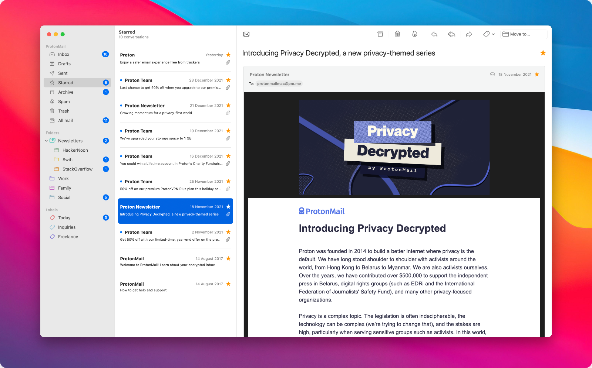
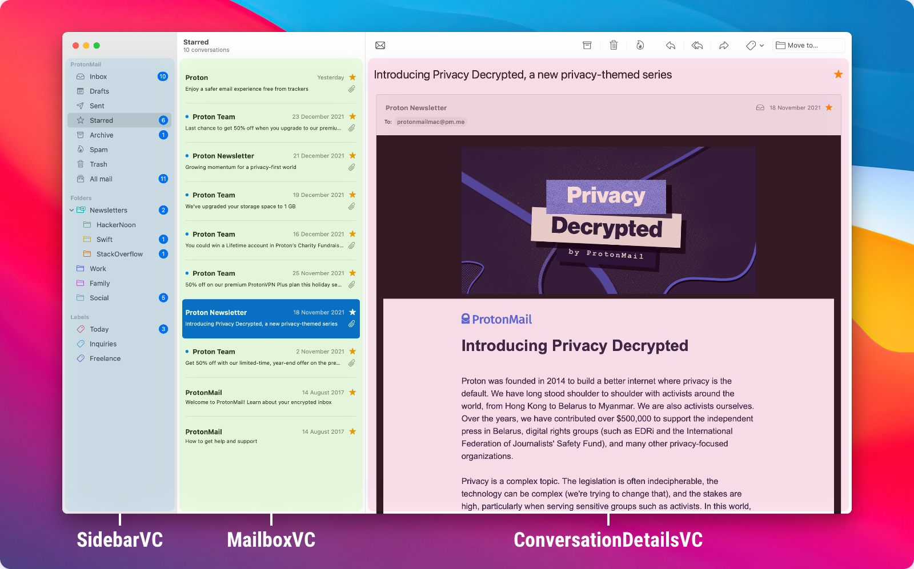

# ProtonMail for macOS

Experimental email client for the ProtonMail service written in Swift.

## About

A pet project, largely incomplete and missing major features. Could be used for reading emails at best at the moment.

### What's working?

1. User authentication (via ProtonMail's web service)
2. Loading conversations and messages (including inline attachments or remote content)
3. Loading custom folders and labels
4. Navigating between folders and labels
5. Applying labels, moving conversations and messages between folders
6. Starring conversations and messages
7. Paging, sort of

### What's missing?

1. Composer (sending emails)
2. Search
3. Downloading attachments
4. Updating "read" status without opening the message
5. Deleting messages
6. Editing custom folders and labels
7. App lock?
8. Menu bar items
9. User preferences
10. Continuous mailbox scroll should be preferred over paging
11. Support for macOS Catalina?
12. Tests, tests, tests
13. Loads of other QoL features

## Architecture

Clean Swift (variation of VIPER) with three major scenes: sidebar, mailbox and details. Built using AppKit and Auto Layout. The app uses the standard `NSSplitViewController` with three items to build the common email client interface.

## Contributions

ProtonMail has [announced plans](https://protonmail.com/blog/engineering-team-2021-update/) for releasing their own desktop client at some point in 2022 so it's unlikely this project is going to amount to anything. If you still feel like contributing to a project like this you are certainly welcome to do so!

## License

The code and data files in this distribution are licensed under the terms of the GNU General Public License as published by the Free Software Foundation, either version 3 of the License, or (at your option) any later version. See https://www.gnu.org/licenses/ for a copy of this license.

Uses software developed by [ProtonMail](https://github.com/ProtonMail).